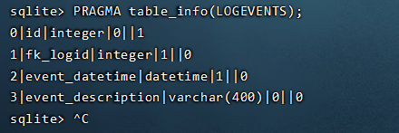

# red-shield-task
红盾杯记录

linux日志审计工具，项目开发中

Linux_log为参考代码，

代码经过修改/添加注释后， 写入rebuildproj.py 文件中

发送给我 或者使用git上传

2022/5/10  汉化部分注释说明，打卡~

2022/5/11 继续汉化部分注释说明，接下来解决为什么LOGEVENTS表没有数据问题，LOGEVENTS表结构如下：

